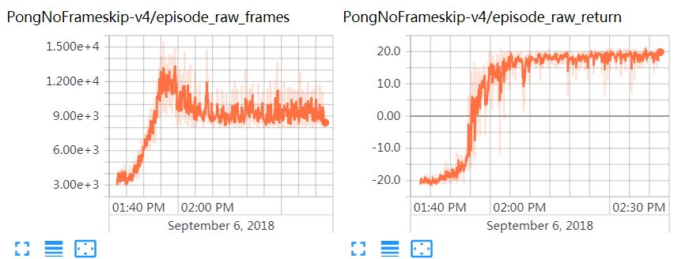
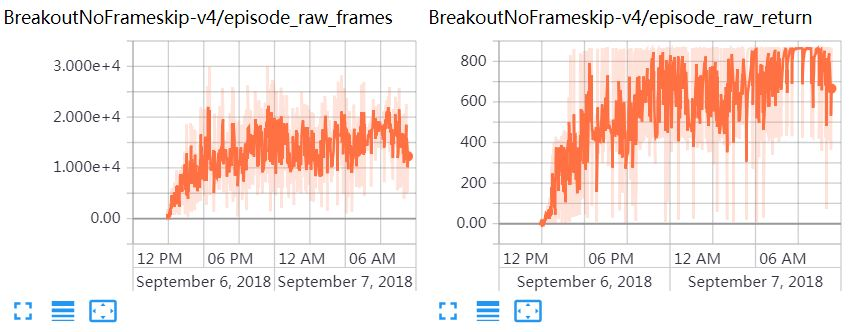

# Important!
This is an attempt to re-write the IMPALA tensorflow code in pytorch.

This is an experiment. 

This is a polite way to say that this code has not been tested anywhere except on the machine it was written on.
No-one should be using it in production for quite some time, or complain when their system halts, melts and catches fire.

You have been warned.

If you wish to contribute or (when this thing becomes more mature) take over maintenance, please create pull requests.


# Our Tweak of IMPALA
Our tweak of the Deep Reinforcement Learning algorithm [IMPALA](https://github.com/deepmind/scalable_agent).
We modify the original code to support:
* Distributed Multiple-learner-multiple-actor training (see [here](sandbox/MLMA.md) for a brief description)
* OpenAI Gym compatibility
* More Neural Network architectures 
* Algorithm arguments (including: gradients clipping)


## Dependencies
Install the following python packages:
* `pytorch`
* [`horovod`](https://github.com/uber/horovod)
* ~~`dm-sonnet`~~  -- sonnet is a library on top of tensorflow. we'll have to use something else (or, failing that, nothing at all)
* [`gym`](https://github.com/openai/gym#atari) (with Atari installed)
* `paramiko`  -- some python/ssh magic. do we really need it? shouldn't horovod be enough?
* `libtmux` -- scripting library for tmux. How're we using it?
* `opencv-python` -- ok, that part might actually be necessary

**Note**: the original IMPALA code is written in python 2.x,
so we recommend you make a virtual environment of python 2.x and pip install the
above packages.
Also, you can simply do everything in docker, see description [here](docker/README.md)

**Note for pytorch**: do re-write this code in pytorch, I'm using:
* python 3.x

and

* anaconda.

If it fails with actual real system-wide python, I'll probably fix that.

Currently (possibly indefinitely) this code has not been tested in docker. 
Please don't bother trying to run it there.

## Running the Code for Training
We offer a couple of ways to run the training code, as described below.

### With Native Distributed Tensorflow and Horovod
First follow the distributed Tensorflow convention to run `experiment.py` as actors,
then follow the Horovod convention to run `experiment.py` as learner(s) with 
`mpirun`. 

See [examples here](sandbox/example_dtf.md).

### With Frontend Code
Run the "frontend script" `run_exeriment_mm_raw.py`,
which wraps `experiment.py` by reading the `learner_hosts` and 
`actor_hosts` from a separate csv file prepared beforehand.
Examples:
```bash
python run_experiment_mm_raw.py \
  --workers_csv_path=sandbox/local_workers_example.csv \
  --level_name=BreakoutNoFrameskip-v4 \
  --agent_name=SimpleConvNetAgent \
  --num_action_repeats=1 \
  --batch_size=32 \
  --unroll_length=20 \
  --entropy_cost=0.01 \
  --learning_rate=0.0006 \
  --total_environment_frames=200000000 \
  --reward_clipping=abs_one \
  --gradients_clipping=40.0
```

See `sandbox/local_workers_example.csv` for the CSV fields you must provide.
The field names should be self-explanatory.

If you have access to some cloud service where you can apply many cheap CPU machines,
(Or you happen to be from internal Tencent and have access to the c.oa.com "compute sharing platform",)
see the description [here](sandbox/coa.md) for how to prepare CSV file.

### With Cluster Management Tool
TODO

## Running the Code for Evaluating
TODO

## Case Studies
### Training Accuracy
The training steps (in time) vs. episode return/length, over PongNoFrameskip-v4, 
with the hyperparameters: 1 learner, 256 actors, ResNetLSTM, unroll_length=40, lr=0.0003, max_steps=400M. 
It reaches ~21 points (the maximum score) in less than 20 mins.



The training steps (in time) vs. episode return/length, over BreakoutNoFrameskip-v4, 
with the hyperparameters: 1 learner, 256 actors, ResNetLSTM, unroll_length=40, entropy_cost=0.1, lr=0.0003, max_steps=400M. 
It reaches >800 points in a few hours. 



### Training Throughput and Scale-Up
For the training throughput and the scale-up when using multiple learners, 
see [here](sandbox/speed.md).

